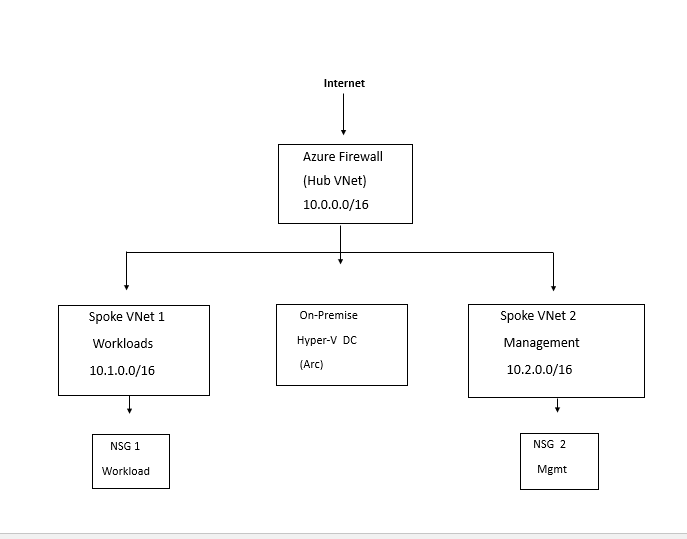

#  Azure Network Security

## Architecture

# Overview
This project documents the design and
implementation of enterprise-grade network
security in Azure using a Hub-and-Spoke
topology with centralised traffic inspection,
network micro-segmentation, deny-all
baseline controls, and forced tunnelling
through Azure Firewall.

Network security in cloud environments
is frequently misunderstood. The common
misconception is that cloud networks are
inherently secure because they are not
the same as corporate LANs. They are not
inherently secure. They are different.
The threats are different, the controls
are different, and the failure modes are
different — but the fundamental requirement
is identical: traffic between resources
should be controlled, inspected, and
logged, and the default posture should
be deny rather than permit.

This project implements that posture
across a multi-tier Azure network
environment connected to the on-premises
infrastructure established previous work.

---

## The Problem This Solves

The default Azure network configuration
allows unrestricted communication between
resources within the same virtual network.
A virtual machine, a database, a storage
account, and an application server placed
in the same VNet can communicate freely
with each other and by default have
outbound internet access without
restriction.

This flat network model creates two
critical security problems.

The first is lateral movement. An adversary
who compromises any resource in a flat
network can attempt to reach every other
resource in that network without
encountering any additional barrier.
The initial compromise becomes a stepping
stone to the entire environment.

The second is exfiltration. Unrestricted
outbound internet access means that a
compromised resource can send data to
an adversary-controlled server without
any network-level control attempting
to detect or block that communication.

Hub-and-Spoke architecture with network
micro-segmentation solves both problems.
Workloads are isolated in dedicated spoke
networks. Traffic between spokes must
traverse the hub and pass through the
firewall. Outbound internet traffic is
forced through the same inspection point.
Lateral movement requires defeating a
network control at every hop. Exfiltration
must pass through a firewall that can
detect and block known malicious
destinations.

---

## The Hub-and-Spoke Decision

Hub-and-Spoke is the Microsoft-recommended
network topology for enterprise Azure
environments and the pattern underpinning
the Azure Landing Zone architecture. The
decision to use it here was not simply
following a recommendation — it was
choosing this pattern over alternatives
for specific architectural reasons.

The alternative most commonly seen in
smaller Azure deployments is a single
flat virtual network containing all
resources. This approach is simple to
implement and works adequately when
the environment is small and security
requirements are minimal. As the
environment grows it becomes
increasingly difficult to apply
consistent controls, impossible to
isolate workloads from each other,
and operationally expensive to
remediate because changing the network
structure requires reconfiguring
everything built on top of it.

Hub-and-Spoke inverts this. The
complexity is front-loaded into the
design. The operational benefit is
that every new workload added to the
environment slots into an existing
governed framework — it is placed in
an appropriate spoke, inherits the
firewall controls from the hub,
and is subject to the same NSG
baseline as every other workload.
Adding the fifteenth workload is
as governed as adding the first.

---

## Network Security Groups —
## The Deny-All Baseline

Every subnet in this architecture has
an associated Network Security Group
with a deny-all inbound rule as the
lowest priority entry.

This is the correct default posture
for Zero Trust network implementation.
In a deny-all baseline, no traffic
reaches a workload unless a specific
rule explicitly permits it. The security
team must make a conscious decision
to allow each traffic flow. Every
allowed flow is documented in the
NSG rule set.

The alternative — a default-allow
posture — means that traffic is
permitted unless a specific rule
blocks it. This creates a situation
where the security team must
anticipate every possible unwanted
traffic pattern and create a rule
to block it. This is not achievable.
Adversaries are creative. The default-
allow model always has gaps.

Deny-all also enforces least-privilege
network access in the same way that
RBAC enforces least-privilege
administrative access. A web server
needs to receive HTTP and HTTPS traffic
on specific ports. It does not need
to receive RDP traffic, SMB traffic,
SQL traffic, or any other protocol.
Deny-all ensures it cannot receive
these by default regardless of what
other changes are made to the
environment.

---

## Azure Firewall — Centralised
## Traffic Inspection

NSGs operate at Layer 4 — they filter
traffic based on source and destination
IP addresses and TCP/UDP port numbers.
They cannot inspect the content of
traffic. They cannot distinguish between
legitimate HTTPS traffic to a trusted
website and HTTPS traffic to a malware
command-and-control server. Both use
TCP port 443.

Azure Firewall operates at Layer 4 and
Layer 7. Network rules filter by IP and
port — the same as NSGs. Application
rules filter by fully qualified domain
name — the destination website or
service — regardless of IP address.
This matters because cloud services
use dynamic IP addresses. A rule that
allows traffic to a specific IP range
for Microsoft Update will break when
Microsoft changes those IPs. A rule
that allows traffic to the FQDN
windowsupdate.microsoft.com works
regardless of the underlying IP.

The Firewall Policy was configured with
threat intelligence in alert mode. Azure
Firewall maintains a regularly updated
feed of known malicious IP addresses
and domains. In alert mode any traffic
to or from a known malicious destination
generates a log entry. In deny mode it
is blocked. I initially deployed in
alert mode to observe the environment
baseline before moving to deny mode —
the same report-only discipline applied
to Conditional Access in Project 2.

---

## Force Tunnelling — No Bypasses

The hub-and-spoke topology with Azure
Firewall only provides traffic inspection
if traffic actually passes through the
firewall. Without user-defined routes
forcing traffic to the firewall, Azure
resources use the default system routes
which send internet-bound traffic
directly to the internet without
inspection.

User-defined route tables were applied
to every spoke subnet with a default
route — 0.0.0.0/0 — pointing to the
Azure Firewall private IP address. This
forces all outbound traffic regardless
of destination through the firewall
inspection point. There are no bypasses.
A workload in any spoke cannot reach
the internet without its traffic being
inspected and logged by the firewall.

This configuration also affects spoke-
to-spoke traffic. Rather than routing
directly between peered spoke networks,
traffic between spokes is forced through
the hub and through the firewall. This
means the firewall logs contain a
complete record of all inter-workload
communication, not just workload-to-
internet communication.

---

## VNet Peering — Gateway Transit

VNet peering connects the hub and spoke
networks at the network layer, enabling
direct routing between them without
traffic traversing the public internet.
Peering is non-transitive by default —
a resource in Spoke 1 cannot communicate
directly with a resource in Spoke 2
even though both are peered with the
hub.

This non-transitivity is actually the
desired behaviour in this architecture.
Spoke-to-spoke traffic should not flow
directly. It should be forced through
the hub and through the firewall. The
combination of non-transitive peering
and user-defined routes achieves this —
spokes can only communicate with each
other via the inspection path through
the hub.

Gateway transit was enabled on the hub
peering configuration. This allows spoke
networks to use a VPN gateway or
ExpressRoute connection deployed in the
hub to reach on-premises resources —
the Domain Controller in this case.
Without gateway transit each spoke would
require its own gateway connection to
reach on-premises, multiplying cost and
operational complexity.

---

## Network Watcher and Flow Logs

Deploying network controls without
logging their operation provides
security without visibility — a
configuration that looks secure in
the portal but provides no evidence
of what is actually happening in the
network.

Network Watcher was enabled in UK South
and NSG flow logs were configured on
every NSG in the environment. Flow logs
capture metadata about every network
flow — source and destination IP,
source and destination port, protocol,
bytes transferred, and whether the
flow was allowed or denied. They do
not capture packet content but the
metadata they provide is sufficient
for the majority of network security
investigation scenarios.

Flow logs were directed to a dedicated
storage account and connected to
Traffic Analytics — a feature that
processes flow log data and produces
visualisations of network traffic
patterns, top talkers, unusual
communication patterns, and
geographic distribution of traffic.
Traffic Analytics data is also
queryable through Log Analytics,
enabling Sentinel analytics rules
to reference network flow data
alongside security events from other
sources.

---

## Connecting to On-Premises

The network architecture must integrate
with the on-premises environment
established in Project 0. The Domain
Controller at UzmaSamiDC01 communicates
with Azure services — Azure AD Connect
synchronisation traffic, Arc agent
communication, Sentinel data collection
— and this communication must be
secured and routed appropriately.

The hub VNet contains the gateway subnet
configured to support a VPN gateway.
The on-premises network connects to
Azure through this gateway, appearing
as a connected network from the Azure
routing perspective. Traffic from the
on-premises DC to Azure passes through
the gateway into the hub and is subject
to the same routing and inspection
controls as any other traffic in the
architecture.

This integration ensures that the network
security boundary extends consistently
from on-premises through to the cloud
rather than treating the hybrid
connection as a trusted exception
that bypasses network controls.

---

## Security Considerations

### The Firewall as a Single Point of Failure

Centralising all traffic through Azure
Firewall creates an availability
dependency. If the firewall becomes
unavailable, traffic between spokes
and from spokes to the internet is
blocked. This is acceptable — a
failed-closed posture is preferable
to a failed-open posture from a
security perspective. Operations are
disrupted but the security boundary
is maintained.

Azure Firewall's availability SLA
addresses this in production
deployments. For environments with
strict availability requirements,
Azure Firewall can be deployed in
a redundant configuration across
availability zones.

### NSG and Firewall Rule Consistency

Operating both NSGs and Azure Firewall
creates a risk of inconsistent rule
sets — traffic permitted by the NSG
but blocked by the firewall, or vice
versa. I maintained a documented
traffic matrix recording the intended
communication patterns for each
workload tier, and validated both
NSG and firewall rules against this
matrix. The NSG and firewall rules
are complementary — NSGs enforce
subnet-level access control and the
firewall provides application-layer
inspection and logging.

---

## Challenges Encountered

*Azure Firewall deployment time*

Azure Firewall deployment takes
significantly longer than most Azure
resources — typically fifteen to
twenty minutes. During initial
deployment attempts I underestimated
this and interpreted slow progress
as an error. Understanding the
deployment timeline is important for
operational planning and for setting
accurate expectations during change
windows.

*Route table conflicts*

An early version of the route table
configuration created a routing loop
— traffic destined for the firewall
was routed back to itself because
the AzureFirewallSubnet had a default
route applied to it. Azure Firewall
subnets must not have user-defined
routes applied. The firewall manages
its own routing. This is documented
in Microsoft's prerequisites but
easy to overlook during initial
implementation.

**Spoke-to-spoke communication
validation**

Validating that spoke-to-spoke traffic
was correctly routing through the
firewall rather than directly between
spokes required deploying test virtual
machines in each spoke and using
Network Watcher connection troubleshoot
to trace the routing path. This
confirmed the route tables were
functioning as intended and that
the firewall logs captured the
inter-spoke traffic as expected.

---

## Lessons Learned

Network security design decisions
made early are expensive to change
later. The address space assigned to
each VNet cannot be modified after
creation without redeploying the
network and everything in it. I planned
the address space with room for growth
— using /16 ranges for VNets and /24
ranges for subnets — to avoid address
exhaustion as the environment expands.

The second lesson was about the
operational cost of security. Azure
Firewall is not free. At approximately
ninety pence per hour it represents
a meaningful cost in a personal lab
environment. I deployed the firewall,
captured all required evidence, and
removed it — a pattern that reflects
a real operational discipline:
understanding the cost of security
controls and making deliberate
decisions about when they are running
rather than leaving them running
indefinitely by default.

The third lesson was that network
security documentation is as important
as network security implementation.
A network with undocumented rules is
a network that cannot be confidently
modified. Every NSG rule in this
environment is documented with its
purpose, its justification, and the
workload it serves.

---

## What I Would Do Differently at Scale

At enterprise scale I would implement
Azure Virtual WAN rather than manually
configured Hub-and-Spoke. Virtual WAN
automates the hub infrastructure,
provides built-in global transit routing,
and simplifies the operational model
for environments spanning multiple
Azure regions.

I would also implement Azure DDoS
Protection Standard on the hub VNet
to protect against volumetric attacks
targeting public-facing resources,
and deploy Azure Firewall Premium
rather than Standard to enable IDPS
— intrusion detection and prevention
— providing signature-based threat
detection at the network layer in
addition to the FQDN filtering and
threat intelligence available in
the Standard SKU.

Private DNS resolver would replace
the current DNS configuration to
provide conditional forwarding for
private endpoint DNS resolution across
the hybrid environment — a requirement
that becomes significant in next project
when private endpoints are deployed.

---

Uzma Shabbir
Azure Security Engineer | AZ-104 | AZ-500
[GitHub](https://github.com/UzmaSami) •
[LinkedIn](https://linkedin.com/in/uzma-shabbir-034361128)
